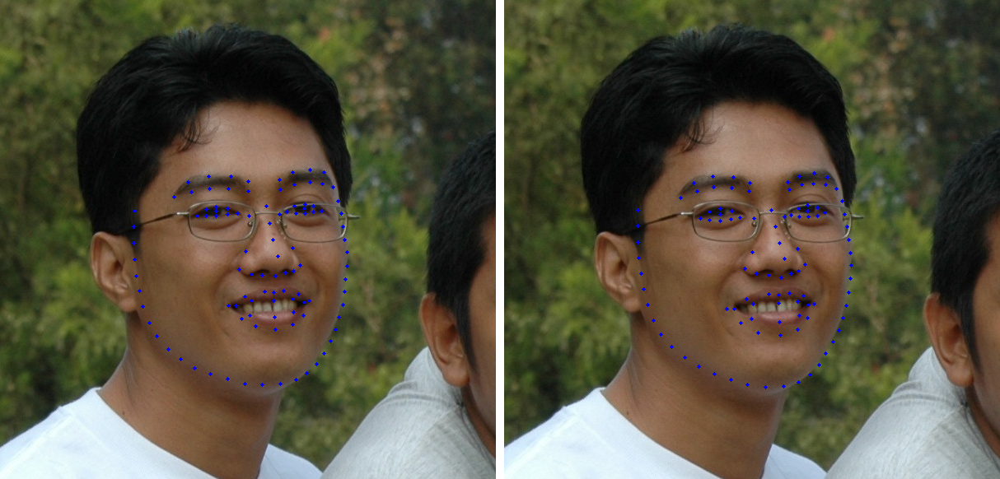
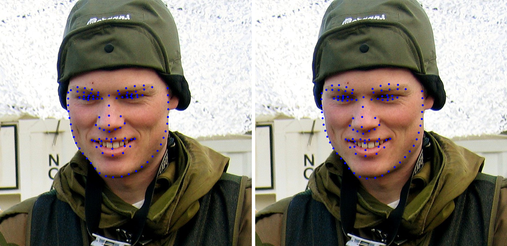

# Human Face Landmark Detection in TensorFlow

This repository contains the code for `Human Face Landmark Detection` using `Landmark Guided Face Parsing` (LaPa) dataset. The pre-trained MobileNetv2 is used for the task in the TensorFlow framework. 
  
**YouTube tutorial**: [Human Face Landmark Detection in TensorFlow using MobileNetv2](https://youtu.be/WVOMGekzbWE)

## Dataset
The LaPa dataset contains the training, validation and testing dataset. Each dataset have images, segmentation mask and the 106 human facial key points.  
 Download the dataset: [Landmark Guided Face Parsing (LaPa)](https://github.com/JDAI-CV/lapa-dataset)
 Dataset paper: [A New Dataset and Boundary-Attention Semantic Segmentation for Face Parsing](https://aaai.org/ojs/index.php/AAAI/article/view/6832/6686)

## Results
The first image has `Ground-Truth Landmarks` and the second image has `Predicted Landmarks`.    

## Contact:
For more follow me on:

- <a href="https://www.youtube.com/idiotdeveloper"> YouTube </a>
- <a href="https://facebook.com/idiotdeveloper"> Facebook </a>
- <a href="https://twitter.com/nikhilroxtomar"> Twitter </a>
- <a href="https://www.instagram.com/nikhilroxtomar"> Instagram </a>
- <a href="https://t.me/idiotdeveloper"> Telegram </a>
